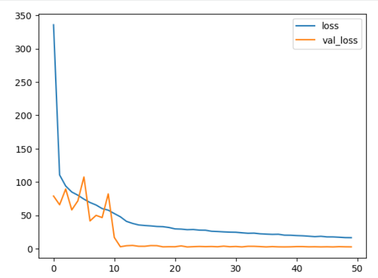

# Facial Keypoint Detection using CNN  
Predicting 5 Key Facial Landmarks (Eyes, Nose, Mouth) with Deep Learning

This project implements a Convolutional Neural Network (CNN) capable of detecting **five key facial landmarks** from face images, using the CelebA dataset. These points include:

- 👁️ Left Eye  
- 👁️ Right Eye  
- 👃 Nose  
- 👄 Left Mouth Corner  
- 👄 Right Mouth Corner  

These landmarks are essential for many real-world applications such as face alignment, emotion analysis, AR effects, driver monitoring systems, and more.

---

## 🚀 Features
- Clean preprocessing pipeline for CelebA dataset  
- Automatic resizing & normalization of images  
- Rescaling landmark coordinates for model compatibility  
- Deep CNN model built with TensorFlow/Keras  
- Visual comparison between **actual vs predicted** keypoints  
- Ability to test on unseen images  

---

## 📁 Dataset
This project uses the **CelebA Facial Attributes Dataset**, available on Kaggle:

🔗 https://www.kaggle.com/datasets/jessicali9530/celeba-dataset

Required files:
- `list_landmarks_align_celeba.csv`
- `img_align_celeba/` image directory

⚠ **Note:**  
The dataset is *not included* in this repository due to its large size and licensing restrictions.

---

## 🧠 Model Architecture

The CNN used in this project follows this architecture:

- Input (100x81x3)
- ↓
- Conv2D → Conv2D → MaxPooling → Dropout
- ↓
- Conv2D → Conv2D → MaxPooling → Dropout
- ↓
- Conv2D → MaxPooling → Dropout
- ↓
- Conv2D → MaxPooling → Dropout
- ↓
- Flatten
- ↓
- Dense (64) + Dropout
- ↓
- Dense (32) + Dropout
- ↓
- Dense (16) + Dropout
- ↓
- Dense (10) # 5 keypoints × (x, y)

A full architecture diagram is available in the `assets/` folder.

---

## 📊 Sample Outputs

### 🔵 Predicted Keypoints  
### 🟢 Actual Keypoints  
(Example images stored in `assets/` folder)

```markdown


```
## ▶️ How to Run
### 1) Install dependencies:
pip install numpy pandas tensorflow matplotlib pillow scikit-learn

### 2) Download the dataset from Kaggle

Place it in your working directory or update the paths inside the notebook.

### 3) Run the Jupyter Notebook:
jupyter notebook

### 4) Train the model & visualize results

The notebook includes:

Data loading

Preprocessing

Model training

Loss visualization

Prediction plotting

### 📦 Project Structure
- │── FacialKeypoints.ipynb
- │── README.md
- │── assets/
- │   ├── prediction_sample.png
- │   ├── loss_curve.png
- │   ├── model_architecture.png
- │── .gitignore

## 🗺️ Roadmap

### ✅ Phase 1 — Current Project

Cleaning & preparing dataset

Building CNN

Predicting 5 facial keypoints

Visualization on unseen faces

### 🚧 Phase 2 — Upcoming Improvements

Add 68 facial landmarks

Improve accuracy with deeper networks

Add real-time detection with OpenCV

Add GPU-compatible training notebook (Colab version)

Export model as .h5 and tflite

Build API endpoint for inference

### 🚀 Phase 3 — Advanced Extensions

Full facial mesh prediction

3D head pose estimation

Integration with AR filters

Live webcam-based keypoint tracking

Mobile deployment using TensorFlow Lite

## Author

Atiye Ziaei
- 📎 LinkedIn: your_profile
- 📎 GitHub: your_profile

Feel free to ⭐ the repository if you found it helpful